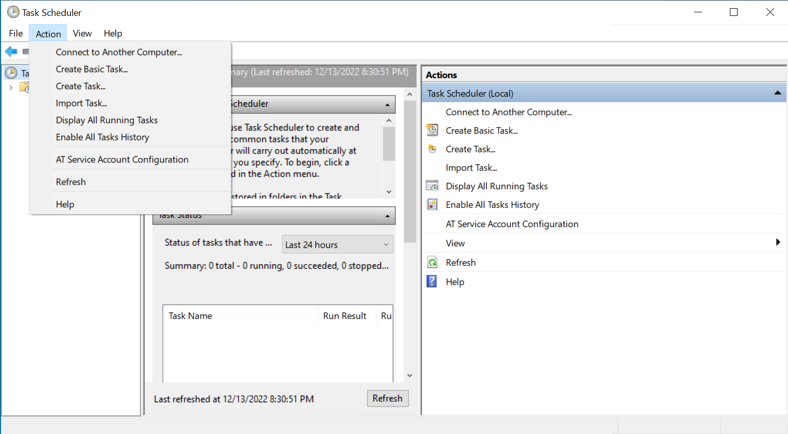
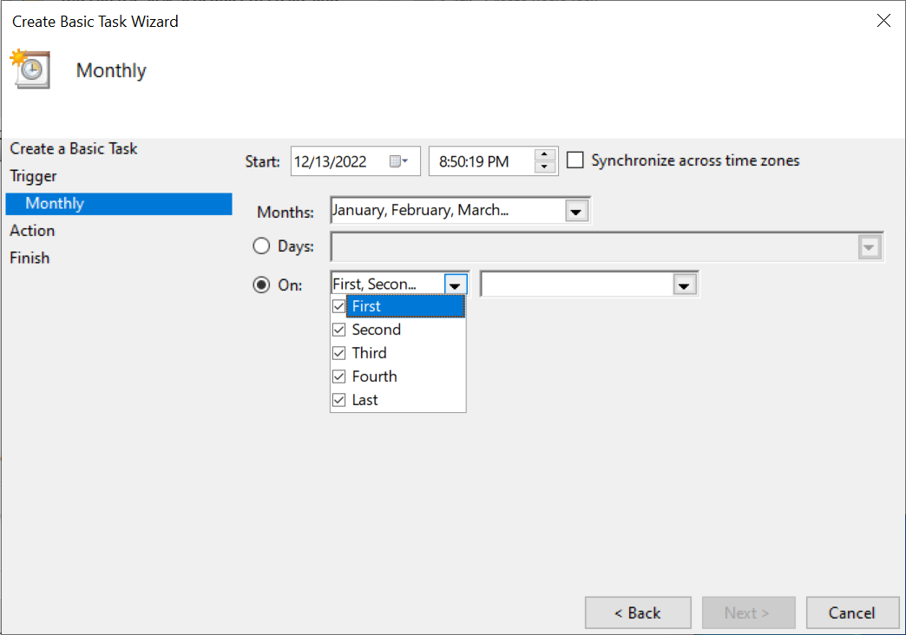
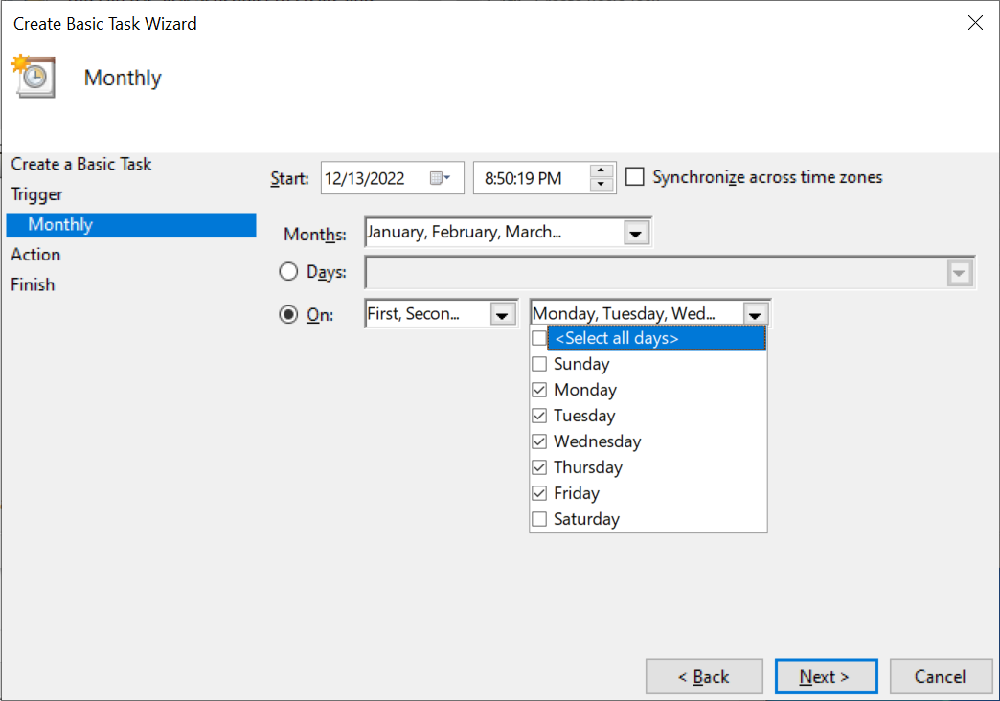
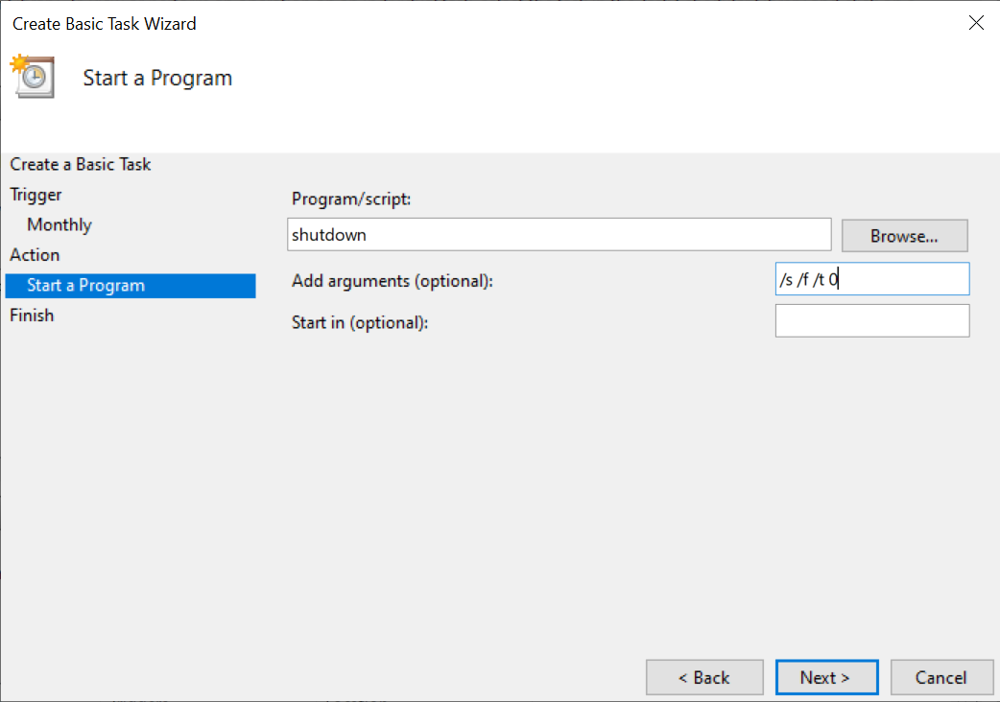

The following procedure describes how to create a shutdown task on your Windows computer that runs on weekdays at 11 pm. This procedure uses the Windows Task Scheduler application and the `shutdown` command, both included with your Windows installation. This procedure takes approximately 5 minutes to complete.

**Procedure**

1. Log in to your Windows account.
2. To start the Task Scheduler application, from the task bar, click the search box, and then type `Task Scheduler`.
3. To create a new scheduled task, from the Task Schedular application, click **Action**, and then click **Create Basic Task**. The **Create Basic Task Wizard** appears. In the following screenshot, the **Action** menu is active:

   

4. Complete the *Create a Basic Task* step:
   1. In the **Name** field, enter a name such as "Shutdown task" for this task.
   2. Optional: In the **Description** field, enter a description for this task.
   3. Click **Next**.
5. Complete the *Task Trigger* step:
   1. Select **Monthly** for the task frequency.
   2. Click **Next**.
6. Complete the *Monthly* step:
   1. For the **Start** field, input `11:00:00 PM`.
   2. For the **Months** field, click the dropdown, and then check **Select all** months.
   3. Click the **On** radio button.
   4. Click the first down arrow, and then check **Fist**, **Second**, **Third**, **Forth**, and **Last**. The following screenshot shows each month week checked:

      

   5. In the same row, click second down arrow, and then check **Monday**, **Tuesday**, **Wednesday**, **Thursday**, and **Friday**. The following screenshot shows the days Monday through Friday checked:

      

   6. Click the **On** radion button again.
   7. Click **Next**.
7. Complete the *Action* step:
   1. Click **Next**.
8. Complete the *Start a Program* step:
   1. In the **Program/script** field, enter `shutdown`.
   2. In the **Add arguments** field, enter `/s /f /t <seconds>`. Replace `<seconds>` with any delay that you want, in seconds, before the shutdown begins, or specify `0` for the shutdown to without delay. In the following screenshot, the program settings are configured:

   

   3. Click **Next**.
9. To save the new task, click **Finish**.

